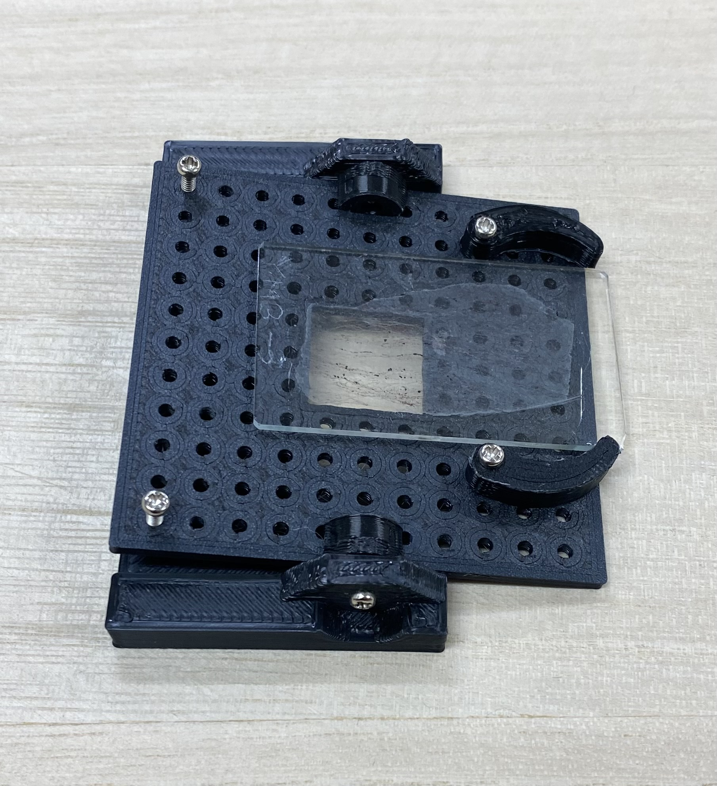
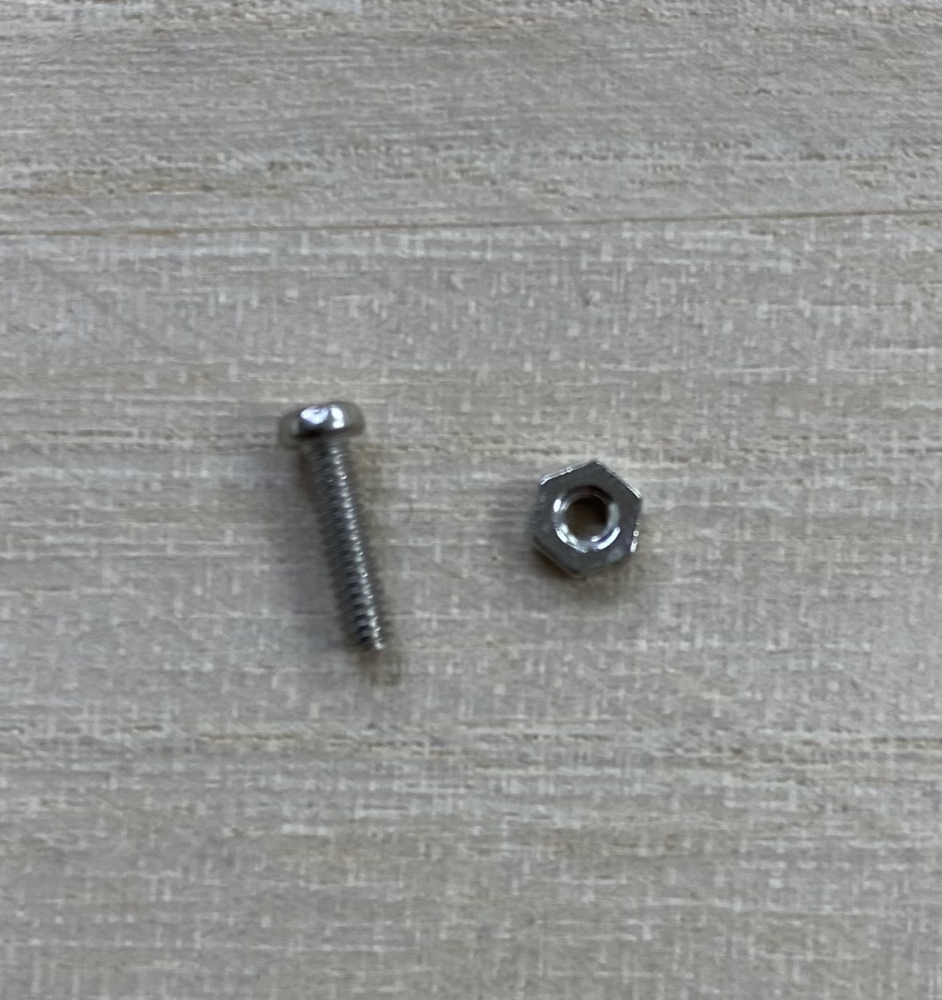
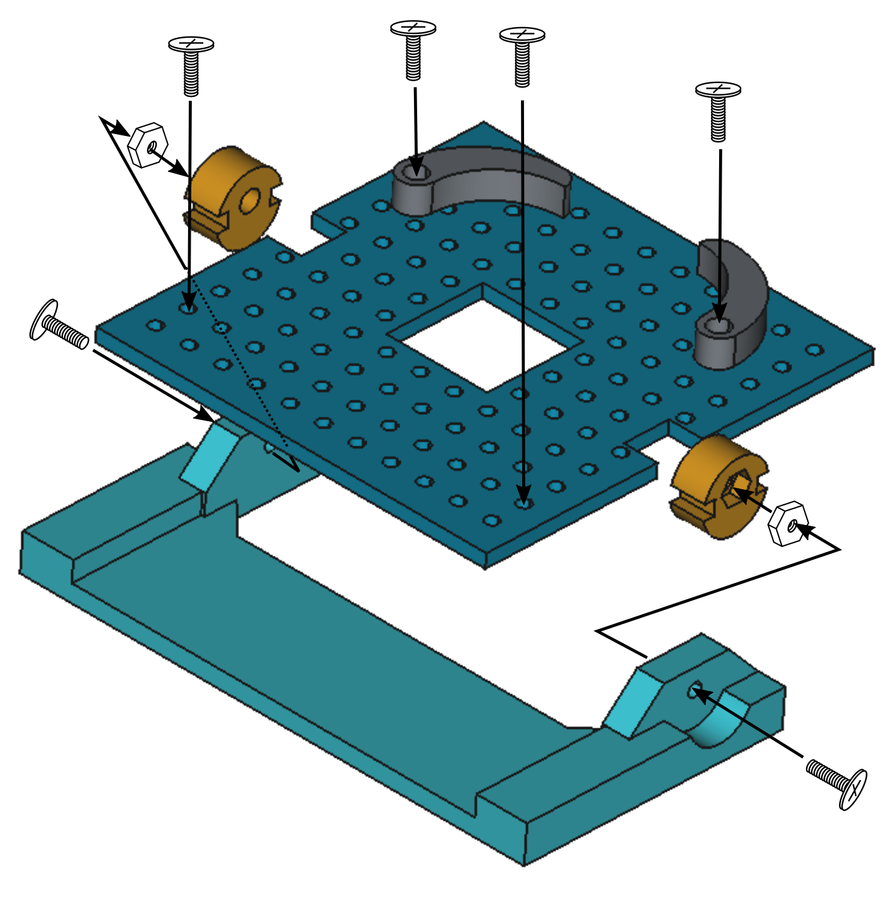
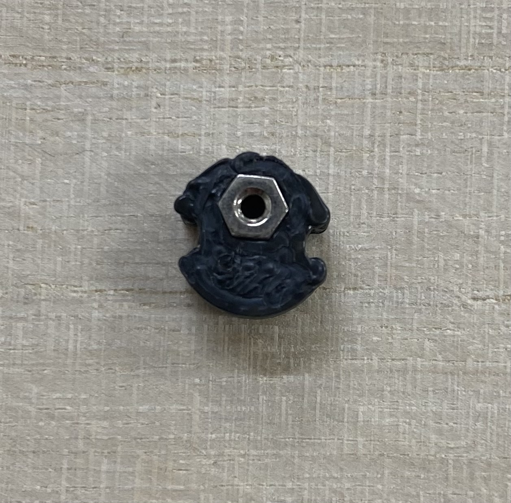
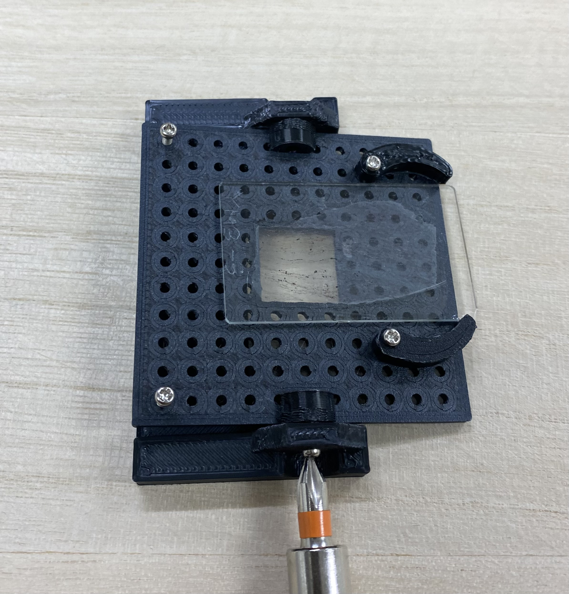
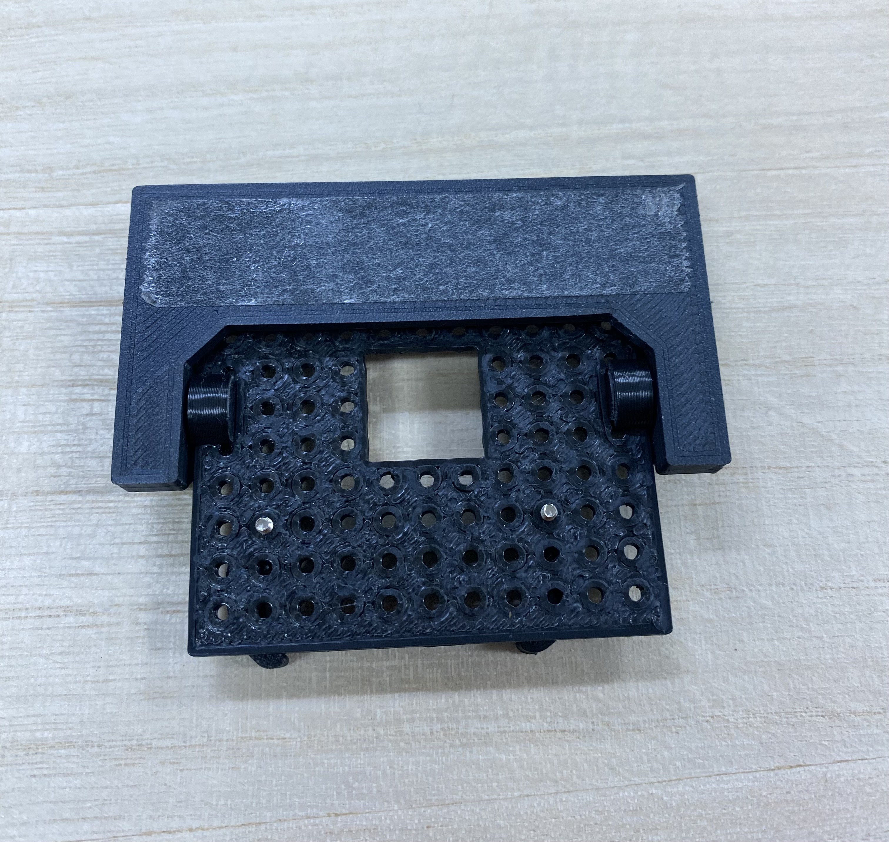
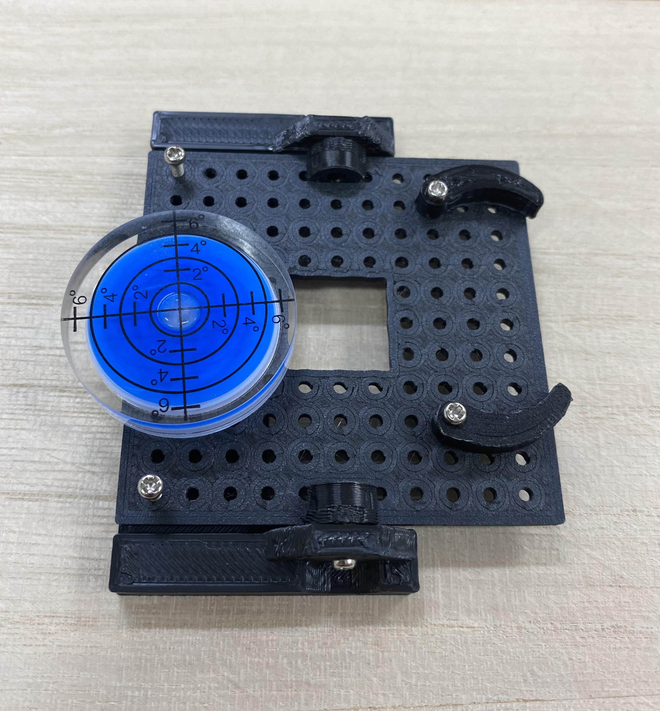

# niconavi-tilt-stage

A thin-section (microscope slide) holder and tilt stage for the NicoNavi software. It is built from four 3D-printed parts plus M2 screws and nuts.

---

## 1. Parts

### 3D-printed parts (STL)

| File | Name | Qty |
| --- | --- | --- |
| [frame.stl](frame.stl) | Frame (U-shaped base) | 1 |
| [plate.stl](plate.stl) | Main plate (perforated plate) | 1 |
| [bearing.stl](bearing.stl) | Bearing (knob / tilt axis) | 2 |
| [clip.stl](clip.stl) | Clip (sample retainer) | 2 |

### Parts to prepare separately

| Item | Qty |
| --- | --- |
| M2 × 8 mm pan-head screw | 6 |
| M2 nut | 2 |
| Double-sided tape | a little |
| Circular bubble level | optional |

### Tools

- Phillips screwdriver
- Vise or pliers (for pressing in the nuts)

---

## 2. Assembly

The overall arrangement is shown below.

### Step 1. Press an M2 nut into the bearing

Push an M2 nut into the hexagonal pocket of the bearing (`bearing.stl`).

- If it will not go in by hand, **press it in with a vise or pliers**.
  The trick is to push evenly with a flat surface.
- **You may also tap it in.** Put the part on a flat surface, place a hard
  block on top of the nut, and tap it in lightly.

Make two of these.

### Step 2. Attach the bearings to the main plate

Fit the two bearings from Step 1 into the notches on the left and right of the
main plate (`plate.stl`) and fix them from above with M2 × 8 mm screws
(**2 screws**).

- **The bearing has an up/down orientation.** The side the nut went into faces
  up — that is, mount it so that **the nut (i.e. the tilt axis) sits slightly
  above the surface of the main plate**. If it is upside down, the axis height
  will not line up.
- The nut faces outward.

### Step 3. Attach the clips

On the top face of the main plate, fix two clips (`clip.stl`) with
M2 × 8 mm screws so that they sit on either side of the square opening
(the viewing window) in the center (**2 screws**).

- **The clips are optional.** Depending on where the thin section sits, it may
  stay put without them. Attach them when the section tends to slide around.
- Tighten the screws **loosely enough that the clips can still rotate**.
  The clips hold the sample by being turned, so do not tighten them fully.
- Point the curved tip of each clip toward the center of the viewing window.

### Step 4. Set the plate on the frame and insert the axis screws

Drop the main plate between the arms of the U-shaped frame (`frame.stl`),
then insert M2 × 8 mm screws through the holes on the outside of the arms and
thread them into the nuts pressed in at Step 1 (**2 screws**).

- How tight they are determines how well the tilt angle holds.
  - Too tight → the plate will not move
  - Too loose → the plate droops during observation

  The sweet spot is when **the plate moves when you push it and stays at that
  angle when you let go**.

### Step 5. Mount on the microscope stage

Apply double-sided tape to the flat bottom face of the frame and stick it onto
the microscope stage.

- Line the viewing window (the square opening) up with the optical path of the
  objective lens before sticking it down.

---

## 3. Usage

### Setting a thin section

1. Place the thin section (slide) over the viewing window and bring the area
   you want to observe to the center of the window.
2. If the section slides around, turn the clips inward to hold its edges lightly.

### Leveling

Place a circular bubble level on the main plate and adjust until the bubble is
centered.

- Adjust with the **two screws on the left side of the photo**, tightening or
  loosening them a little at a time.
